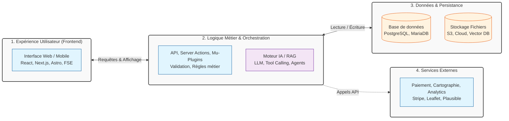

# 🚀 Architectures Web & IA : Blueprints & Cas Pratiques

> **Un référentiel de modèles d'architecture d'applications** combinant technologies web modernes, structuration de l'information et intégration d'intelligence artificielle.
>
> **L'objectif :** Passer rapidement d'une idée de projet ou d'un besoin métier à une vision technique claire, robuste, accessible et pérenne.

---

## 💡 Pourquoi ce dépôt ? (Problème / Solution)

| Le Problème | La Solution apportée ici |
| :--- | :--- |
| La "page blanche" au démarrage d'un projet et la difficulté à choisir les bonnes technologies. | Des **stacks techniques éprouvées** et justifiées pour des cas d'usage réels. |
| Le fossé de communication entre les besoins métiers et les contraintes techniques. | Des schémas visuels (Mermaid) et un vocabulaire commun compréhensible par tous. |
| L'accessibilité et la performance traitées comme des rustines en fin de projet. | Une approche **"Shift-Left"** : RGAA/WCAG, écoconception et sécurité intégrés dès la conception. |

---

## 🗺️ Vue d'ensemble d'une Architecture Moderne

Chaque fiche de ce dépôt suit une logique de séparation des préoccupations (Separation of Concerns). Voici le modèle mental récurrent :

---

## 📂 Cas d'Usage & Fiches d'Architecture

Chaque fiche détaille les briques logiques, les choix techniques, les flux de données et les points de vigilance (Sécurité, Accessibilité, Coûts).

### 🤖 IA & Expérience Utilisateur
*Comment intégrer l'IA de manière utile, éthique et performante.*
- 📄 [**UX Agentique & Chat-First**](agentic-ux-chat-first.md) : Remplacer la navigation par l'intention. Stack LLM, Tool Calling et RAG.
- 📄 [**RAG pour Service Client**](architecture-rag-service-client.md) : Assistant virtuel fiable, sourcé et conforme RGPD/HDS.

### 🛒 E-commerce, Catalogues & Sites Vitrines
*Performance, SEO local et gestion de contenu éditorial.*
- 📄 [**Catalogue Auto Headless**](architecture-site-vitrine-catalogue-auto-headless.md) : Astro + Pages CMS. Zéro maintenance, 100% statique.
- 📄 [**Gestion de Menus de Restauration**](architecture-application-full-stack-gestion-de-menus-restauration.md) : Next.js Full-stack, accessibilité et souveraineté des données.
- 📄 [**Catalogue Interactif Data-Driven**](architecture-catalogue-interactif-data-driven.md) : Moteur React/Vite réutilisable piloté par manifeste JSON (Flipbook/Swiper).

### 🏛️ Patrimoine, Archives & Structuration de Données
*Préservation de la mémoire, interopérabilité et données complexes.*
- 📄 [**Écosystème Patrimonial (WP + Omeka S + Zotero)**](architecture-ecosysteme-patrimonial-wp-omeka-zotero.md) : Le meilleur des deux mondes : narration grand public et rigueur archivistique.
- 📄 [**Plateforme de Mémoire Orale (Tasdawit)**](architecture-plateforme-tasdawit-omeka-scripto.md) : Collecte, transcription communautaire (Scripto/Whisper) et conservation HDS.

### 📱 No-Code, Low-Code & Prototypage
*Solutions rapides pour valider un marché ou un besoin pédagogique.*
- 📄 [**Application de Suivi Éducatif**](architecture-nocode-adalo-figma-app-suivi-educatif.md) : Adalo + Figma. Prototypage rapide avec Design System et flux de données clairs.

### ⚙️ Socle Technique & Multi-Sites
*Industrialisation et maintenance à l'échelle.*
- 📄 [**Agenda Multi-Sites (Code Commun)**](architecture-agenda-code-commun-unifie.md) : Un seul plugin Meta Box/Mu-plugin déployé sur plusieurs sites WordPress indépendants.

---

## 🛠️ Méthodologie & Standards de Qualité

La technique ne vaut rien sans rigueur. Le dossier [`methodologie/`](methodologie/) contient les grilles de lecture et les guides utilisés pour construire ces architectures :

- 📐 [**Guide de rédaction de diagrammes Mermaid**](methodologie/guide-mermaid.md) : Comment créer des schémas clairs, maintenables et accessibles.
- ♿ [**Checklist d'Accessibilité (RGAA / WCAG)**](methodologie/checklist-accessibilite.md) : Les points de contrôle non-négociables avant toute mise en production.

---

## 🎯 Comment utiliser ce dépôt ?

Ce référentiel est conçu pour être une **source unique de vérité** (Single Source of Truth) adaptable à votre rôle :

| Votre Profil | Comment en tirer parti ? |
| :--- | :--- |
| **Chef de Projet / Product Owner** | Piochez une fiche pour rédiger vos user stories, estimer la complexité et valider la faisabilité technique avant le développement. |
| **Développeur / Architecte** | Récupérez la structure des briques logiques, les recommandations de stack et les pièges à éviter pour démarrer un projet sur des bases saines. |
| **Formateur / Apprenant / Jury** | Utilisez ces fiches comme des études de cas pédagogiques complètes pour enseigner ou évaluer la capacité à concevoir un système d'information cohérent. |

---

## 👤 Auteur & Contact

**Stéphane Arrami**
*Architecte de l'Information · Expert Accessibilité (RGAA/WCAG) · Formateur*
📍 Lyon, France (Disponible en remote ou sur site)
🌐 [Portfolio](https://stephane-arrami.com) · [💼 LinkedIn](https://www.linkedin.com/in/stephane-arrami/)

> *Ce dépôt est sous licence [CC BY-SA 4.0](https://creativecommons.org/licenses/by-sa/4.0/). Vous êtes libre de partager et d'adapter ce contenu, à condition d'en créditer l'auteur et de partager vos modifications dans les mêmes conditions.*