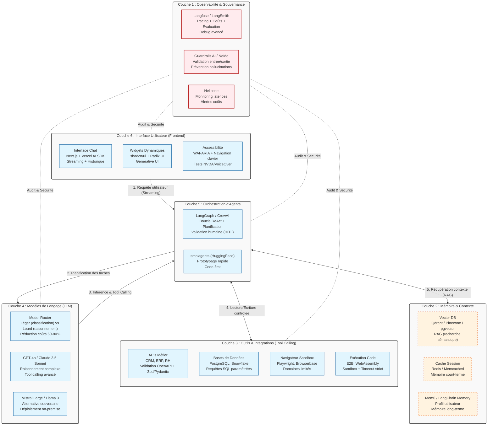

# Fiche Définition : Agentic UX & Chat-First

## 1. Définition courte (Opérationnelle)

L'**Agentic UX** désigne un mode d'interaction où le système numérique agit comme un agent (semi-)autonome capable de planifier, d'utiliser des outils et d'exécuter des tâches complexes pour atteindre un objectif défini par l'utilisateur, sans nécessiter de micro-gestion.

L'approche **Chat-First** place l'interface conversationnelle (texte ou voix) comme point d'entrée principal ou unique de cette interaction, remplaçant la navigation hiérarchique traditionnelle (menus, arborescence) par l'expression directe d'une intention.

> **Synthèse** : L'utilisateur ne *navigue* plus pour trouver un outil ; il *énonce* un but, et l'agent conversationnel orchestre les actions pour l'atteindre.

---

## 2. Définition longue (Contextuelle et Méthodologique)

Cette nouvelle façon de concevoir les interfaces marque une transition du **GUI** (Graphical User Interface) vers le **CUI** (Conversational User Interface) enrichi de capacités d'agent autonome (parfois appelé **AUI** - Agentic User Interface).

### Fonctionnement architectural
Le système repose sur une boucle de raisonnement (ex : pattern *ReAct* : Reasoning + Acting).
1. **Compréhension** : Le LLM analyse l'intention et le contexte.
2. **Planification** : L'agent décompose la demande et sélectionne les outils disponibles (APIs, BDD, composants UI).
3. **Exécution et Feedback** : L'agent exécute, observe les résultats, et informe l'utilisateur, en demandant une validation humaine (*Human-in-the-loop*) pour les actions critiques.

### Enjeux d'accessibilité (RGAA / WCAG)
- *Opportunité* : Une interface de chat bien conçue est nativement linéaire, compatible avec les lecteurs d'écran.
- *Risque* : Syndrome de la "page blanche", surcharge cognitive, difficulté pour les utilisateurs en situation de handicap moteur ou cognitif.
- *Exigence* : Fournir des suggestions de prompts, garantir la navigation clavier, proposer des alternatives multimodales (boutons, voix, bascule vers une interface graphique).

### Enjeux d'Architecture de l'Information et SEO
Une interface purement "Chat-First" (SPA qui ne charge du contenu que via API après requête) est invisible pour les moteurs de recherche. Une architecture hybride est nécessaire : le contenu doit rester exposé en HTML sémantique, le chat venant en surcouche interactive.

### IA Responsable et Éthique
Le principe de *transparence* est crucial. L'utilisateur doit savoir qu'il interagit avec un agent, comprendre quelles actions l'agent s'apprête à effectuer, et avoir un moyen simple d'interrompre le processus.

---

## 3. Architecture Technique et Stack

---

## 4. Flux d'exécution typique

**Étape 1 — Utilisateur** : « Compare les ventes Q1 et Q2, et envoie le rapport à mon manager. »

**Étape 2 — Orchestrateur (LangGraph)** : analyse l'intention et identifie 3 sous-tâches :
- Récupérer les données de ventes
- Générer un rapport comparatif
- Envoyer par email

**Étape 3 — Agent (avec LLM GPT-4o)** :
- Étape a) : appel de l'outil `query_database` avec paramètres validés → récupération des données brutes Q1/Q2
- Étape b) : appel de l'outil `generate_report` → génération du rapport structuré (markdown + graphique)
- Étape c) : demande de validation humaine → « Je vais envoyer ce rapport à manager@entreprise.com. Confirmez-vous ? »

**Étape 4 — Utilisateur** : « Oui, envoie. »

**Étape 5 — Agent** : appel de l'outil `send_email` → « Rapport envoyé avec succès. »

**Étape 6 — Interface** : affiche le rapport dans le chat (Generative UI), confirme l'envoi, propose des actions suivantes.

---

## 5. Points de Vigilance Méthodologiques

### 1. Sécurité (principe du moindre privilège)
- Chaque outil doit avoir des permissions minimales (lecture seule par défaut).
- Les actions d'écriture, suppression ou envoi nécessitent **toujours** une validation humaine.
- Isoler les outils dans des sandboxes (Docker, WebAssembly, E2B).

### 2. Gestion des erreurs et fallback
- Définir des timeouts stricts pour chaque appel d'outil (ex : 10 secondes maximum).
- Prévoir des messages d'erreur clairs et des alternatives (escalade humaine, suggestion de reformulation).
- Ne jamais laisser l'agent boucler indéfiniment (maximum 5 à 10 itérations).

### 3. Coûts maîtrisés
- Mettre en place un cache sémantique (GPTCache, Redis) pour les requêtes similaires.
- Router vers des modèles légers quand c'est possible.
- Monitorer les coûts par utilisateur, session et jour.

### 4. Accessibilité non négociable
- Le chat doit être 100 % navigable au clavier.
- Les réponses doivent être structurées sémantiquement (listes, titres, liens).
- Proposer des alternatives aux suggestions de prompts (boutons, voix).
- Tester systématiquement avec NVDA et VoiceOver.

### 5. Transparence et confiance
- Afficher les étapes de raisonnement de l'agent (« Je consulte la base de données... »).
- Citer les sources quand l'agent s'appuie sur des documents.
- Permettre à l'utilisateur de voir l'historique complet des actions.

### 6. Tests et évaluation
- Créer des batteries de tests (DeepEval, Ragas) pour évaluer la qualité des réponses.
- Tester les cas limites (requêtes ambiguës, hors domaine, tentatives d'injection).
- Mesurer la satisfaction utilisateur et le taux de résolution sans escalade humaine.

---

## 6. Recommandations de Démarrage

### Pour un MVP (Minimum Viable Product)
- **Orchestration** : LangGraph (contrôle, observabilité)
- **LLM** : Claude 3.5 Sonnet ou GPT-4o (bon équilibre qualité/coût)
- **Mémoire** : PostgreSQL + pgvector (simple, tout-en-un)
- **Interface** : Next.js + Vercel AI SDK + shadcn/ui
- **Observabilité** : Langfuse (open-source, gratuit pour démarrer)

### Pour une mise en production
- Ajouter un système de routing de modèles (modèles légers + lourds).
- Mettre en place des guardrails stricts (Guardrails AI).
- Implémenter un cache sémantique agressif.
- Déployer des tests automatisés de qualité et d'accessibilité.
- Prévoir un mécanisme d'escalade humaine robuste.

---

> *Note : Cette fiche est conçue pour être un artefact d'architecture de l'information vivant. Elle est versionnable, modifiable et sert de référence pour l'alignement entre les équipes techniques et les décideurs.*