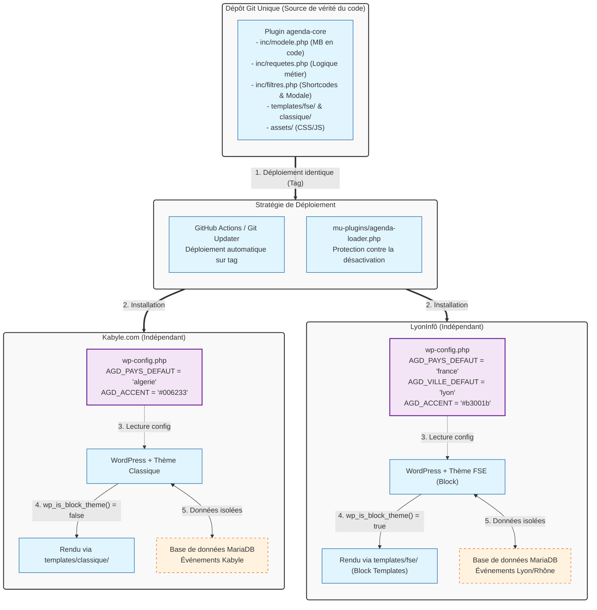

# Fiche Définition : Architecture Agenda Multi-Sites (Base de Code Commune)

## 1. Définition courte (Opérationnelle)

Ce projet repose sur une approche **"Write Once, Deploy Everywhere"** (écrire une fois, déployer partout). Un unique plugin, `agenda-core`, est versionné sur Git et déployé à l'identique sur plusieurs installations WordPress indépendantes (Kabyle.com, LyonInfô, Amazigh24). Chaque site gère sa propre base de données et ses événements, tandis que le comportement du plugin s'adapte automatiquement au contexte local via des constantes de configuration (`wp-config.php`) et la détection du type de thème (FSE ou classique).

> **Synthèse** : Une architecture à couplage faible qui garantit une maintenance centralisée, une cohérence fonctionnelle absolue et une totale indépendance éditoriale et technique des sites, sans aucune synchronisation de données.

---

## 2. Définition longue (Contextuelle et Méthodologique)

Cette approche élimine la complexité et la fragilité des synchronisations API inter-sites. Elle repose sur trois règles d'or qui rendent la base de code véritablement commune et pérenne.

### Règle 1 : Structure de données définie en code (Pas de MB Builder UI)
Les Custom Post Types, taxonomies et champs Meta Box sont déclarés programmatiquement via le filtre `rwmb_meta_boxes` dans le fichier `modele.php`. **Interdiction formelle** d'utiliser l'interface Meta Box Builder pour créer ces champs, car cela stocke la configuration dans la base de données (`wp_options`), entraînant inévitablement des divergences entre les sites. Meta Box (AIO) reste installé comme une dépendance système sur chaque site.

### Règle 2 : Configuration pilotée par l'environnement
Aucune logique métier ne doit être codée en dur pour un site spécifique. Les variations (pays/ville par défaut, couleur d'accentuation, comportement spécifique) sont injectées via des constantes dans le `wp-config.php` de chaque site ou via un filtre `agenda_config`. Le plugin lit ces valeurs au runtime avec des valeurs par défaut sécurisées.

### Règle 3 : Détection et adaptation au type de thème
Le plugin utilise `wp_is_block_theme()` pour adapter son rendu :
- **Sur un thème FSE (LyonInfô)** : Il enregistre des modèles de blocs natifs (via `register_block_template` ou `block_templates`) pour l'archive et le single événement.
- **Sur un thème classique (Kabyle.com)** : Il fournit des templates PHP de secours dans le dossier `templates/classique/`.
Dans les deux cas, le thème actif (ou son enfant) conserve la priorité et peut surcharger ces templates, suivant le principe de hiérarchie de WordPress (similaire à WooCommerce).

### Enjeux d'Accessibilité et d'Écoconception
L'accessibilité (modale `<dialog>`, carte Leaflet avec alternative textuelle, galerie avec `alt`) et l'écoconception (cache des compteurs, Leaflet léger, images WebP) sont intégrées au cœur du plugin commun, garantissant que chaque site bénéficie des mêmes standards de qualité sans effort supplémentaire.

---

## 3. Architecture Technique et Stack



---

## 4. Flux d'exécution typique

**Étape 1 — Configuration** : Sur LyonInfô, l'administrateur définit `define('AGD_VILLE_DEFAUT', 'lyon');` dans `wp-config.php`. Sur Kabyle.com, cette constante n'est pas définie (le plugin utilise sa valeur par défaut ou une autre).

**Étape 2 — Saisie** : Un utilisateur crée un événement sur LyonInfô. Le plugin `agenda-core` (via `modele.php`) garantit que les champs Meta Box (date, lieu, galerie) sont identiques à ceux de Kabyle.com, car définis en code.

**Étape 3 — Affichage (Branche FSE)** : Un visiteur consulte l'archive sur LyonInfô. Le plugin détecte `wp_is_block_theme() === true`. Il injecte ses modèles de blocs FSE. La modale `[agenda_destination]` s'affiche, pré-sélectionnant "France" grâce à la configuration.

**Étape 4 — Affichage (Branche Classique)** : Sur Kabyle.com, le plugin détecte un thème classique. Il charge les templates PHP du dossier `templates/classique/`. La modale fonctionne de la même manière, mais avec la couleur d'accentuation définie dans le `wp-config.php` de Kabyle.com.

**Étape 5 — Maintenance** : Une nouvelle fonctionnalité (ex: export iCal amélioré) est ajoutée au dépôt Git. Un tag `v1.2.0` est créé. GitHub Actions déploie automatiquement la mise à jour sur les deux sites. Les deux sites bénéficient de la correction sans intervention manuelle ni risque de divergence.

---

## 5. Points de Vigilance Méthodologiques

### 1. Discipline absolue sur la définition des champs
- **Règle d'or** : Aucun champ ne doit être créé via l'admin WordPress (MB Builder). Tout doit passer par le fichier `inc/modele.php`.
- Si un champ doit être ajouté, il est ajouté au code, commité, et déployé. Cela garantit que la structure des données est strictement identique sur tous les sites, facilitant les requêtes et les exports futurs.

### 2. Gestion des surcharges de templates
- Documenter clairement dans le `README` du plugin quels fichiers de template peuvent être surchargés par le thème (ex: `templates/classique/single-evenement.php`).
- Utiliser des hooks (`do_action`, `apply_filters`) à l'intérieur des templates pour permettre aux thèmes d'injecter du contenu spécifique sans copier-coller tout le fichier.

### 3. Matrice de test avant déploiement
- Puisque le plugin sert deux contextes radicalement différents (FSE et Classique), **tout déploiement en production doit être précédé d'un test en préproduction sur les deux types de sites**.
- Un test qui passe sur LyonInfô (FSE) ne garantit pas qu'il ne casse pas l'affichage sur Kabyle.com (Classique).

### 4. Protection du plugin
- Utiliser un fichier `agenda-loader.php` dans le dossier `wp-content/mu-plugins/` qui contient simplement `require_once __DIR__ . '/agenda-core/agenda-core.php';`.
- Cela rend le plugin "Must-Use" : il ne peut pas être désactivé accidentellement depuis l'interface d'administration, garantissant la stabilité du site.

### 5. SEO et Données structurées
- Le fichier `inc/seo.php` doit générer le JSON-LD `Event` de manière dynamique, en utilisant les données du site courant. Les coordonnées géographiques et les informations de lieu doivent être correctement mappées depuis les champs Meta Box, quel que soit le site.

---

## 6. Structure du Plugin (Référence)

```text
agenda-core/
├── agenda-core.php          # Point d'entrée : chargement, constantes, config par site
├── inc/
│   ├── modele.php           # CPT, taxonomies, champs Meta Box (via rwmb_meta_boxes)
│   ├── requetes.php         # pre_get_posts, tri, filtres, compteurs (transients)
│   ├── filtres.php          # Shortcodes [agenda_destination], [agenda_filtres], modale
│   ├── pagination.php       # Gestion de la pagination conservant les filtres URL
│   ├── seo.php              # Génération JSON-LD Event, balises meta geo, robots
│   ├── ics.php              # Export iCal des événements
│   └── cron.php             # Archivage automatique des événements passés
├── templates/
│   ├── fse/                 # Modèles de blocs (HTML avec commentaires WP) pour LyonInfô
│   └── classique/           # Templates PHP de secours pour Kabyle.com
└── assets/                  # CSS (variables custom properties) et JS (modale, Leaflet)
```

---

## 7. Recommandations de Démarrage

### Configuration type (`wp-config.php`)
```php
// --- Configuration Agenda-Core pour LyonInfô ---
define( 'AGD_PAYS_DEFAUT', 'france' );
define( 'AGD_VILLE_DEFAUT', 'lyon' );
define( 'AGD_ACCENT', '#b3001b' ); // Rouge bordeaux
define( 'AGD_CACHE_COMPTEURS', HOUR_IN_SECONDS );

// --- Configuration Agenda-Core pour Kabyle.com ---
// define( 'AGD_PAYS_DEFAUT', 'algerie' ); // Exemple de surcharge
// define( 'AGD_ACCENT', '#006233' ); // Vert
```

### Déploiement
1. **Dépôt Git** : Créer un repo privé `agenda-core-wp`.
2. **Protection** : Ajouter `agenda-loader.php` dans le dossier `mu-plugins` de chaque site.
3. **Automatisation** : Configurer une GitHub Action simple qui, lors de la création d'un tag (ex: `v1.0.0`), se connecte en SSH aux serveurs de préproduction, puis de production, pour mettre à jour le dossier `wp-content/plugins/agenda-core/`.
4. **Alternative simple** : Utiliser le plugin "Git Updater" sur les sites WordPress pour qu'ils détectent les nouveaux tags du dépôt Git et proposent la mise à jour dans l'interface d'administration classique.

---

> *Note : Cette fiche est conçue pour être un artefact d'architecture de l'information vivant. Elle formalise une approche professionnelle de développement WordPress multi-sites, privilégiant la maintenabilité à long terme, la cohérence du code et l'indépendance des données.*