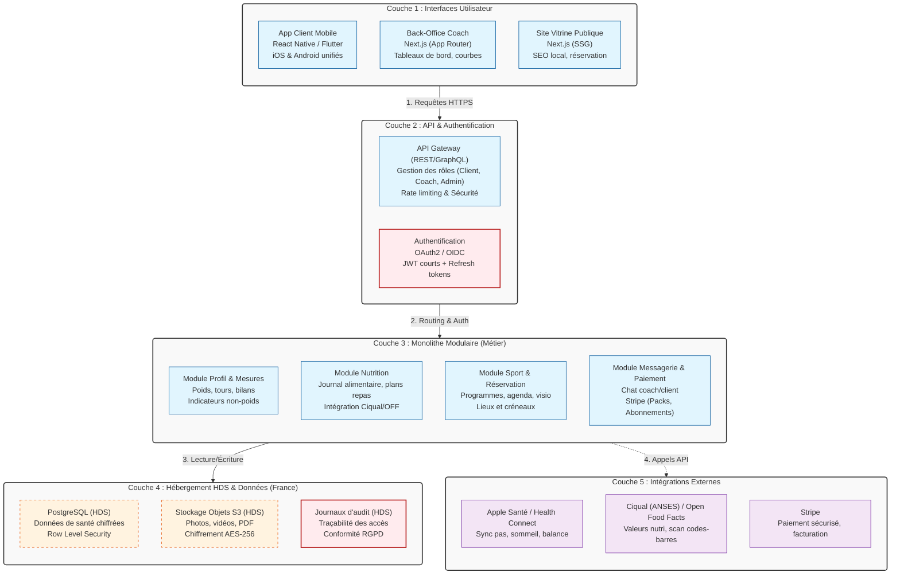

# Fiche Définition : Architecture App Coaching Bien-être & Santé (HDS)

## 1. Définition courte (Opérationnelle)

Ce projet désigne la conception d'un écosystème numérique de suivi de santé et de coaching sportif (contexte : *Mon Coach Lyonnais / My Next Body*). Il repose sur un **monolithe modulaire** hébergé sur une infrastructure certifiée **HDS** (Hébergeur de Données de Santé), servant une application mobile cross-platform pour les clients et un back-office web pour les coachs. L'approche privilégie une UX éthique (bienveillante, non-culpabilisante) et une conformité stricte au RGPD pour les données de santé sensibles.

> **Synthèse** : Une architecture souveraine et modulaire qui place la protection des données de santé et l'éthique du suivi (notamment post-bariatrique/obésité) au cœur de l'expérience utilisateur et du code.

---

## 2. Définition longue (Contextuelle et Méthodologique)

Cette nouvelle façon de concevoir les applications de santé s'éloigne des microservices (trop coûteux pour un cabinet) et des solutions SaaS génériques (non conformes HDS) pour proposer un backend unique, découpé en modules métier bien séparés (NestJS ou Django).

### Fonctionnement architectural
Le système est structuré en trois interfaces (App mobile client, Back-office web coach, Site vitrine SEO) qui consomment une API unique. Le cœur métier (profil, nutrition, sport, réservation, messagerie, paiement) réside dans un monolithe modulaire. Cela réduit drastiquement les coûts d'infrastructure et de maintenance, tout en permettant d'extraire un module en microservice plus tard si la charge l'exige.

### Enjeux d'UX Éthique et d'Accessibilité (RGAA / WCAG)
Le public concerné (suivi de l'obésité, post-sleeve) nécessite une conception responsable : permettre de masquer le poids au profit d'autres indicateurs (énergie, sommeil), bannir le vocabulaire culpabilisant ("triche", "écart"), et prévoir des alertes coach en cas de signaux de troubles alimentaires. L'interface doit être apaisante, claire et 100 % accessible.

### Enjeux de Conformité (RGPD Santé & HDS)
Le suivi de poids, IMC et pathologies constitue des données de santé. L'hébergement chez un prestataire certifié HDS en France (OVHcloud, Scaleway) est obligatoire. Cela implique un consentement explicite, un chiffrement des données au repos et en transit, des journaux d'accès auditables et une AIPD (Analyse d'Impact) documentée.

### Souveraineté des données et intégrations
L'application s'appuie sur des bases de données publiques françaises (Ciqual de l'ANSES) et européennes (Open Food Facts). La synchronisation avec les écosystèmes de santé natifs (Apple Santé, Health Connect) évite la ressaisie tout en restant sous le contrôle de l'utilisateur.

---

## 3. Architecture Technique et Stack

---

## 4. Flux d'exécution typique

**Étape 1 — Saisie client** : Le client scanne un code-barres via l'app mobile. L'app interroge l'API Open Food Facts, récupère les données nutritionnelles et les ajoute au journal du jour.
**Étape 2 — Synchronisation santé** : En arrière-plan, l'app synchronise les pas et le sommeil de la journée via Apple Santé / Health Connect, sans ressaisie manuelle.
**Étape 3 — Alerte coach** : Le module "Profil et Mesures" détecte une perte de poids trop rapide sur 7 jours. Une alerte discrète remonte dans le tableau de bord Next.js du coach.
**Étape 4 — Ajustement** : Le coach consulte la fiche du client, voit l'alerte, et envoie un message bienveillant via le module "Messagerie" pour ajuster le plan repas et proposer un point visio.
**Étape 5 — Réservation et Paiement** : Le client réserve sa séance de suivi via le site vitrine ou l'app. Le module "Paiement" (Stripe) débit le pack de séances et met à jour le solde en temps réel.

---

## 5. Points de Vigilance Méthodologiques

### 1. Conformité HDS et RGPD Santé (Critique)
- L'hébergement (base de données, stockage, logs) **doit** être certifié HDS.
- Réaliser une AIPD (Analyse d'Impact relative à la Protection des Données) avant le développement.
- Obtenir un consentement explicite, granulaire et séparé pour le traitement des données de santé.

### 2. UX Éthique et Bienveillante
- Ne jamais utiliser de vocabulaire stigmatisant ("triche", "écart", "mauvais élève").
- Permettre à l'utilisateur de masquer son poids de l'interface et de privilégier des indicateurs de santé globale (énergie, qualité du sommeil, régularité).
- Intégrer des garde-fous : alertes automatiques pour le coach en cas de restriction calorique sévère ou de signaux de troubles alimentaires.

### 3. Sécurité et Chiffrement
- Chiffrement des données de santé au repos (AES-256) et en transit (TLS 1.3).
- Implémenter le Row Level Security (RLS) dans PostgreSQL pour garantir qu'un client ne peut jamais accéder aux données d'un autre, même via une faille applicative.
- Ne jamais stocker de tokens Stripe ou de données bancaires en base (utiliser les tokens Stripe).

### 4. Intégrations Santé et Vie Privée
- La synchronisation avec Apple Santé et Health Connect doit être optionnelle et explicitement consentie.
- Ne récupérer que les données strictement nécessaires au suivi (principe de minimisation).

### 5. Accessibilité (RGAA / WCAG)
- Le back-office coach (Next.js) et le site vitrine doivent être conformes RGAA.
- L'app mobile doit respecter les guidelines d'accessibilité iOS (VoiceOver) et Android (TalkBack), notamment pour la navigation dans les graphiques de suivi.

### 6. Gestion de la dette technique
- Le monolithe modulaire impose une discipline stricte : les modules ne doivent pas avoir de dépendances circulaires. Utiliser des frontières claires (ex: architecture hexagonale ou DDD léger) à l'intérieur du monolithe.

---

## 6. Recommandations de Démarrage

### Pour un MVP (V1 - 3 à 4 mois)
- **Backend** : NestJS ou Django (monolithe modulaire).
- **Frontends** : React Native (Expo) pour l'app client, Next.js pour le back-office coach.
- **Données** : PostgreSQL sur un serveur dédié HDS (ex: OVHcloud ou Scaleway).
- **Fonctionnalités** : Inscription, profil, journal alimentaire manuel, programmes assignés, messagerie basique, réservation et paiement Stripe (packs).
- **Conformité** : Rédaction des CGU/CGV spécifiques santé, mise en place de l'AIPD.

### Pour une mise en production (V2 et V3)
- **V2 (Automatisation)** : Ajout de la synchronisation Apple Santé/Health Connect, scan de codes-barres (Open Food Facts), bibliothèque de vidéos d'exercices, rappels push intelligents.
- **V3 (Expansion)** : Visio intégrée (WebRTC ou API type Daily.co), gestion multi-cabinets (Lyon, Paris), tableaux de bord d'équipe pour les coachs salariés.
- **Interopérabilité** : Étudier la connexion avec l'application existante (*My Next Body*) : remplacement, extension ou API de synchronisation ?

---

> *Note : Cette fiche est conçue pour être un artefact d'architecture de l'information vivant. Elle intègre les contraintes métier spécifiques au suivi de l'obésité et post-bariatrique, et sert de référence pour l'alignement entre les coachs, les développeurs et le DPO (Délégué à la Protection des Données).*