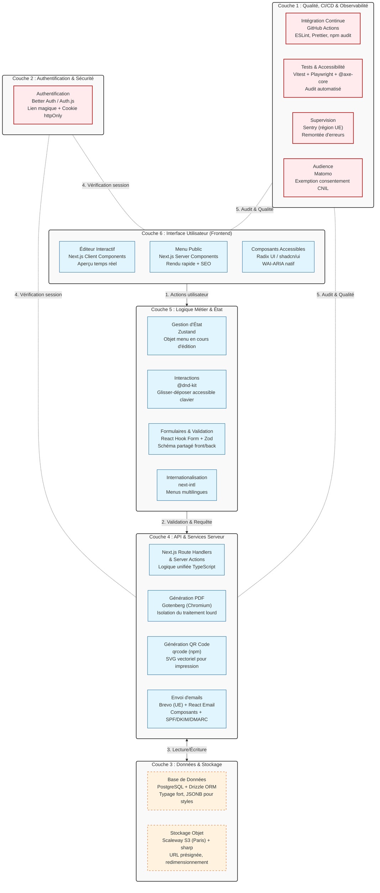

# Fiche Définition : Architecture Full-Stack pour Application de Menus (Qwenta)

## 1. Définition courte (Opérationnelle)

Ce type d'application présente deux visages aux exigences opposées : un **éditeur back-office** très interactif (réaction à la frappe, glisser-déposer) et un **menu public** consulté sur mobile, qui doit s'afficher instantanément, être parfaitement accessible et indexable par les moteurs de recherche.

Le choix structurant est d'utiliser un **framework full-stack** (comme Next.js avec l'App Router) plutôt qu'une architecture découplée (SPA React + API séparée). Cela permet de gérer l'éditeur via des composants clients et le menu public via du rendu serveur (SSR/SSG), le tout dans une seule base de code cohérente et typée.

> **Synthèse** : Unifier le développement pour offrir une interactivité maximale à l'éditeur et une performance/SEO optimale au client final, sans dupliquer la logique métier.

---

## 2. Définition longue (Contextuelle et Méthodologique)

Cette approche de conception répond aux exigences modernes de performance web, d'accessibilité et de souveraineté des données, tout en servant de support pédagogique robuste pour évaluer la montée en compétence d'un développeur.

### Fonctionnement architectural
L'application repose sur une séparation intelligente des responsabilités au sein du même framework. L'éditeur utilise des *Client Components* pour gérer l'état local (Zustand) et les interactions (dnd-kit). Le menu public utilise des *Server Components* pour pré-rendre le HTML, garantissant un chargement rapide et une indexation SEO native. L'API n'est pas un service externe, mais est intégrée via des *Route Handlers* et des *Server Actions*, partageant le même typage TypeScript que le frontend.

### Enjeux d'accessibilité (RGAA / WCAG)
L'accessibilité n'est pas une option : les composants d'interface (dialogues, listes, popovers) sont délégués à des bibliothèques éprouvées (Radix UI / shadcn/ui) qui gèrent nativement le focus et les lecteurs d'écran. Le glisser-déposer (dnd-kit) est spécifiquement choisi pour sa compatibilité clavier, un point souvent négligé dans les éditeurs visuels.

### Enjeux d'Architecture de l'Information et SEO
Le menu public doit être compris par les moteurs de recherche. L'architecture intègre nativement la génération de données structurées (Schema.org `Restaurant` / `Menu`) et une gestion du multilingue (next-intl) pour les zones touristiques. Le rendu côté serveur garantit que le contenu est présent dans le HTML initial, contrairement à une SPA qui dépend de l'exécution JavaScript.

### Souveraineté et Éthique des données
Les choix techniques privilégient la conformité RGPD et la souveraineté européenne : hébergement des données et du stockage objet en France (Scaleway), authentification par lien magique avec cookies `httpOnly` (évitant les failles XSS des JWT en localStorage), et mesure d'audience via Matomo configuré en exemption CNIL.

---

## 3. Architecture Technique et Stack

---

## 4. Flux d'exécution typique

**Étape 1 — Éditeur** : Le restaurateur modifie le prix d'un plat et ajoute un allergène via l'interface. Zod valide la saisie en temps réel. Zustand met à jour l'aperçu instantanément.
**Étape 2 — Publication** : Le restaurateur clique sur "Publier". Une Server Action est déclenchée, vérifiant l'authentification (cookie httpOnly).
**Étape 3 — Sauvegarde** : Drizzle ORM insère/met à jour les données dans PostgreSQL (gestion de la relation n-n pour les allergènes).
**Étape 4 — Génération des assets** : Le système génère un nouveau QR code (SVG) et, si demandé, un PDF via Gotenberg en utilisant le HTML/CSS du rendu serveur.
**Étape 5 — Affichage Public** : Un client scanne le QR code. Next.js sert la page pré-rendue (SSR/SSG) en quelques millisecondes, avec les balises Schema.org injectées pour le SEO.
**Étape 6 — Supervision** : Sentry monitore l'absence d'erreur, et Matomo enregistre la visite de manière conforme RGPD.

---

## 5. Points de Vigilance Méthodologiques

### 1. Sécurité des données et des sessions
- Utiliser exclusivement des cookies `httpOnly` et `Secure` pour les sessions, jamais de JWT dans le `localStorage`.
- Les uploads d'images doivent passer par des URL présignées (S3) pour éviter que le serveur ne traite directement les fichiers lourds.

### 2. Gestion des erreurs et résilience
- Prévoir des fallbacks visuels si le service de génération PDF (Gotenberg) est temporairement indisponible.
- Valider systématiquement les données côté serveur avec Zod, même si la validation frontend a déjà eu lieu.

### 3. Accessibilité non négociable
- Tester le réordonnancement des plats (dnd-kit) exclusivement au clavier (Tab, Espace, Flèches).
- S'assurer que les dialogues de confirmation (Radix UI) gèrent correctement le piège à focus (focus trap).

### 4. Performance et SEO
- Utiliser `next/image` (ou l'équivalent avec `sharp`) pour servir des formats modernes (WebP/AVIF) et éviter le layout shift.
- Vérifier que les données structurées (Schema.org) sont valides via l'outil de test de Google.

### 5. Souveraineté et conformité
- S'assurer que toutes les dépendances externes (Brevo, Sentry, Scaleway) traitent les données dans l'UE.
- Configurer Matomo pour anonymiser les IP et respecter l'exemption de consentement.

### 6. Dette technique et maintenance
- Verrouiller les versions des dépendances critiques (ex: `drizzle-orm`, `@dnd-kit/core`) et utiliser Dependabot ou Renovate pour les mises à jour de sécurité.

---

## 6. Recommandations de Démarrage & Angle Pédagogique

### Pour un MVP (Apprentissage / OpenClassrooms)
La stack proposée par un apprenant (ex: React/Vite + Express + MongoDB) est **valide pédagogiquement** pour démontrer la maîtrise des bases. Cependant, l'evaluateur doit poser la question structurante : *"Si le périmètre s'élargit (SEO critique, besoin de rendu serveur, relations de données complexes), lequel de tes choix tient encore, et lequel devient fragile ?"*
- *Adaptation possible* : Rendre la page publique via un template EJS/Pug côté Express, utiliser un tableau de codes pour les allergènes dans MongoDB, et intégrer la librairie `qrcode`.

### Pour une mise en production (Réel projet client)
- **Framework** : Migrer vers Next.js (App Router) pour unifier le code et garantir le SEO.
- **Base de données** : Privilégier PostgreSQL + Drizzle ORM pour la robustesse des relations (allergènes) et le typage de bout en bout.
- **Hébergement** : Conteneur Scaleway + PostgreSQL managé (région Paris) pour la souveraineté et la simplicité de gestion des disques éphémères.
- **Qualité** : Imposer une chaîne CI (GitHub Actions) avec `@axe-core/playwright` pour bloquer toute fusion introduisant une régression d'accessibilité.

---

> *Note : Cette fiche est conçue pour être un artefact d'architecture de l'information vivant. Elle sert à la fois de référence technique pour le développement et de grille d'évaluation pédagogique pour les jurys de certification (CDUI/DWWL).*