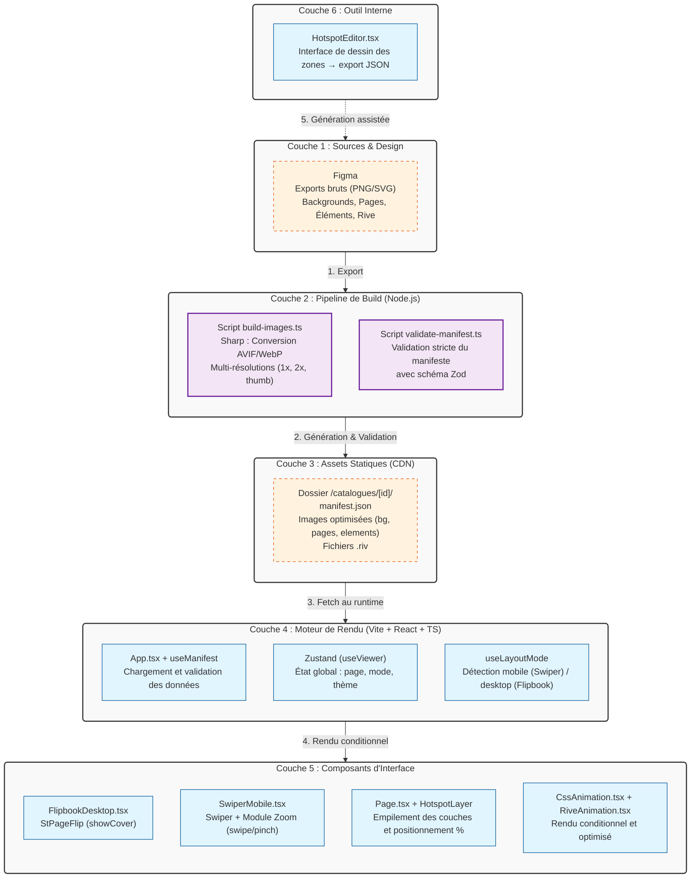

# Fiche Définition : Architecture Catalogue Interactif Data-Driven

## 1. Définition courte (Opérationnelle)

Ce projet repose sur une séparation stricte entre le **moteur de rendu** (une application React/Vite réutilisable) et les **données du catalogue** (un dossier de ressources et un manifeste JSON). Pour publier un nouveau catalogue, il suffit d'ajouter un dossier de données sans modifier une seule ligne de code. L'application s'adapte dynamiquement au format, aux pages, aux thèmes et aux points d'intérêt (hotspots) définis dans le manifeste, en proposant une expérience flipbook sur desktop et un swipe fluide sur mobile.

> **Synthèse** : Une architecture "Write Once, Read Many" (écrire une fois, lire partout) qui transforme des exports Figma statiques en une expérience interactive, performante et maintenable, validée par des schémas stricts (Zod).

---

## 2. Définition longue (Contextuelle et Méthodologique)

Cette approche répond aux besoins des campagnes marketing (prospectus, catalogues saisonniers) en éliminant la dette technique des reconstructeurs de pages manuels. Elle privilégie la génération statique, l'optimisation des assets et une expérience utilisateur adaptative.

### Fonctionnement architectural
L'application est un lecteur universel. Au chargement, elle récupère le `manifest.json` du catalogue demandé. Ce manifeste, validé par Zod, décrit la structure du catalogue (pages, sections, thèmes) et la position de chaque élément interactif (hotspots produits, animations CSS, animations Rive). Le moteur de rendu (StPageFlip ou Swiper) utilise ces données pour composer dynamiquement les vues.

### Enjeux d'accessibilité (RGAA / WCAG)
- **Hotspots** : Chaque zone interactive doit être un élément focusable (`tabindex="0"`), avec un `aria-label` descriptif et une action déclenchable au clavier (Entrée/Espace).
- **Animations** : Les animations CSS et Rive doivent respecter la préférence système `prefers-reduced-motion`.
- **Navigation** : La barre de navigation et le sommaire (thumbnails) doivent être entièrement navigables au clavier et annoncés correctement par les lecteurs d'écran.

### Enjeux d'Architecture de l'Information et SEO
Bien que ce soit une Single Page Application (SPA), le déploiement statique permet un pré-rendu ou une génération de métadonnées Open Graph dynamiques par catalogue. Les clics sur les produits doivent être traçables (Plausible/GA4) pour mesurer l'engagement réel, au-delà des simples pages vues.

### Performance et Écoconception
- **Optimisation des images** : Le script de build (`sharp`) génère des formats modernes (AVIF/WebP) en plusieurs résolutions (1x, 2x, miniature), servant uniquement ce qui est nécessaire.
- **Chargement paresseux** : Le hook `usePreload` ne charge en mémoire que la page courante et les pages adjacentes (±2), libérant la mémoire et accélérant le rendu initial.
- **Rive optimisé** : Les animations Rive ne sont instanciées dans le DOM que lorsque la page qui les contient est visible à l'écran.

---

## 3. Architecture Technique et Stack



---

## 4. Flux d'exécution typique

**Étape 1 — Préparation des données** : Le graphiste exporte les assets depuis Figma vers `assets-source/jours-gagnants/`. L'outil interne `HotspotEditor` est utilisé pour dessiner les zones et générer le `manifest.json`.

**Étape 2 — Build** : Le script Node.js exécute `sharp` pour convertir les images en AVIF/WebP (ex: `p01-1365.avif`, `p01-2730.avif`). Le script `validate-manifest.ts` vérifie que le JSON correspond exactement au schéma Zod (types de hotspots, coordonnées, existence des fichiers).

**Étape 3 — Chargement** : L'utilisateur arrive sur `monsite.com/catalogue/jours-gagnants`. L'application charge `manifest.json`. Zustand initialise l'état (page 1, mode déterminé par `useLayoutMode`).

**Étape 4 — Rendu Adaptatif** :
- *Sur mobile* : `SwiperMobile` affiche la page 1 en plein écran. L'utilisateur swipe ou pinch-zoom.
- *Sur desktop* : `FlipbookDesktop` affiche les pages 1 et 2 en double page, avec l'effet de couverture sur la page 1.

**Étape 5 — Interaction** : L'utilisateur voit un halo animé (CSS) sur un produit. Il clique sur le hotspot. Une fiche produit s'ouvre (modale ou redirection). L'événement est envoyé à Plausible/GA4. Le hook `usePreload` a déjà chargé en arrière-plan les pages 2, 3 et 4 pour une navigation instantanée.

---

## 5. Points de Vigilance Méthodologiques

### 1. Intégrité des Données (Le rôle de Zod)
Le manifeste est la source unique de vérité. Le schéma Zod doit être strict : vérifier que les coordonnées `x, y, w, h` sont bien des pourcentages (0-100), que les références aux images existent, et que les types de hotspots (`product`, `css`, `rive`) sont respectés. Un manifeste invalide doit bloquer le build ou afficher une erreur claire, pas un écran blanc.

### 2. Performance et Mémoire
- Le préchargement (`usePreload`) est crucial pour l'illusion de fluidité du flipbook, mais il doit être limité (±2 pages) pour ne pas saturer la mémoire du navigateur, surtout sur mobile avec des images 2x.
- Les animations Rive doivent être détruites ou mises en pause lorsque la page n'est plus active dans le DOM (gestion du cycle de vie React).

### 3. Accessibilité des Hotspots
- Les hotspots ne doivent pas être de simples `div` avec un `onClick`. Ils doivent être des `<button>` ou des éléments avec `role="button"`, `tabindex="0"`, et un `aria-label` explicite (ex: "Voir le détail du produit [Nom], page 4").
- Le focus clavier doit être visible et logique, en suivant l'ordre de lecture de la page.

### 4. Responsive et Adaptabilité
- Le passage du mode simple (mobile) au mode double (desktop) doit être fluide. `useLayoutMode` doit écouter les redimensionnements de fenêtre (`resize`) et mettre à jour l'état Zustand, ce qui forcera le remontage du composant Viewer approprié.
- Les coordonnées des hotspots en pourcentage (%) garantissent qu'ils restent bien positionnés quel que soit le redimensionnement du livre.

### 5. Écoconception
- Utilisation systématique de `loading="lazy"` sur les images hors du viewport immédiat.
- Respect de `@media (prefers-reduced-motion: reduce)` pour désactiver les keyframes CSS (spin, pulse, bounce) et les transitions de page trop rapides.

---

## 6. Recommandations de Démarrage (Ordre de construction)

L'ordre de développement proposé est le plus robuste pour itérer rapidement :

1. **Mobile First (Swiper)** : C'est le mode le plus simple et le plus utilisé. Valider d'abord l'affichage d'une page, le swipe, le zoom et le rendu des hotspots de base.
2. **Pipeline d'images** : Mettre en place les scripts `sharp` et `zod` pour automatiser la conversion et la validation. C'est le fondement de la performance.
3. **Desktop (Flipbook)** : Intégrer `StPageFlip`. La force de cette architecture est que le composant `Page.tsx` et `HotspotLayer.tsx` sont **exactement les mêmes** que sur mobile, seul le conteneur change.
4. **Animations** : Ajouter les couches CSS (halo, éclairs) puis Rive, en s'assurant qu'elles ne bloquent pas le thread principal.
5. **Éditeur de Hotspots** : Développer l'outil interne `HotspotEditor.tsx` en dernier, une fois que le format du manifeste est totalement stabilisé par les étapes précédentes.

### Pour une mise en production
- **Hébergement** : Vercel ou Netlify pour le déploiement statique continu (CI/CD) et le CDN global.
- **Monitoring** : Plausible Analytics (respectueux de la vie privée) configuré avec des événements personnalisés sur les clics de hotspots `product`.
- **Fallback** : Prévoir un lien "Télécharger le catalogue en PDF" pour les utilisateurs dont les navigateurs ne supportent pas les fonctionnalités avancées (très rare, mais bonne pratique d'accessibilité).

---

## 7. Modèle de Données de Référence (Manifeste)

```typescript
// src/types/catalogue.ts

export type Hotspot =
  | { type: "product"; x: number; y: number; w: number; h: number; sku: string; url?: string }
  | { type: "css"; x: number; y: number; w: number; h: number; src: string; anim: "spin" | "pulse" | "bounce" | "pop" }
  | { type: "rive"; x: number; y: number; w: number; h: number; src: string; stateMachine: string };

export type Page = {
  n: number;
  content: string;                       // ex: "pages/p04" → le script ajoute les suffixes de résolution
  background?: { theme: string; side: "left" | "right" };
  hotspots: Hotspot[];
};

export type Catalogue = {
  id: string;
  title: string;
  format: { w: 1365; h: 1931 }; // Format de base pour le calcul des ratios
  sections: { name: string; theme: string; from: number; to: number }[];
  pages: Page[];
};
```

---

> *Note : Cette fiche est conçue pour être un artefact d'architecture de l'information vivant. Elle formalise une approche industrielle de la création de catalogues interactifs, où la rigueur du typage (TypeScript/Zod) et l'optimisation des assets (Sharp) garantissent une expérience utilisateur fluide, accessible et maintenable à long terme.*