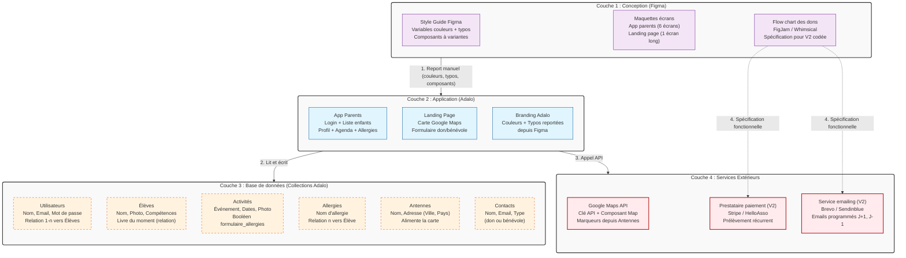

# Fiche Définition : Architecture NoCode pour Application de Suivi Éducatif (Avenirs)

## 1. Définition courte (Opérationnelle)

Ce projet repose sur une **architecture NoCode en trois couches** : **Figma** pour la conception (Style Guide amorce de design system), **Adalo** pour la construction de l'application et l'hébergement des données, et des **services extérieurs** (Google Maps, prestataire de paiement) pour les fonctionnalités spécialisées. L'application permet à des parents de suivre le parcours éducatif de leurs enfants (compétences, activités, allergies) au sein d'une association, avec une landing page publique pour les dons et le bénévolat.

> **Synthèse** : Unifier la conception visuelle (Figma) et la logique applicative (Adalo) dans un seul projet, en gardant une frontière claire avec les services extérieurs et la future V2 codée.

---

## 2. Définition longue (Contextuelle et Méthodologique)

Ce type d'architecture NoCode est particulièrement adapté aux prototypes rapides, aux MVP associatifs et aux projets pédagogiques (OpenClassrooms). Elle impose une rigueur méthodologique forte pour compenser l'absence de code explicite.

### Fonctionnement architectural
L'application est structurée autour de **6 collections de données** dans Adalo (Utilisateurs, Élèves, Activités, Allergies, Antennes, Contacts), reliées entre elles par des relations (1-n, n-n). Chaque écran est un gabarit qui se remplit dynamiquement à partir de la collection courante, via le mécanisme d'**Available Data** d'Adalo. Le Style Guide Figma amorce un design system avec des variables (couleurs, typographie) et des composants à variantes, reportés manuellement dans les réglages de branding d'Adalo.

### Enjeux d'accessibilité (RGAA / WCAG)
Adalo impose des contraintes fortes : les composants natifs ne sont pas tous conformes WCAG. Le Style Guide doit documenter les contrastes (texte blanc sur noir, texte noir sur pêche #FCE5CD), la taille minimale des zones tactiles (44x44 px), et la navigation au clavier. Les icônes doivent être accompagnées de libellés (barre d'onglets du bas). Le flow chart des dons, futur développement codé, devra intégrer les critères d'accessibilité dès le brief développeur.

### Enjeux d'Architecture de l'Information et SEO
La landing page publique (1 écran long) est le seul point d'entrée indexable. Adalo ne permet pas un SEO avancé : le brief doit anticiper une V2 codée (Next.js) pour le référencement. Les données structurées (Schema.org `Organization` / `DonateAction`) seront à implémenter côté développeur. Le flow chart des dons, documenté dans Figma/FigJam, sert de spécification fonctionnelle pour cette V2.

### Souveraineté et Éthique des données
Les données enfants sont sensibles (allergies, photo, email parent). Le brief doit préciser : hébergement des données Adalo (cloud US par défaut, à signaler), durée de conservation, droit de suppression (RGPD art. 17), et séparation stricte entre la collection **Utilisateurs** (parents connectés) et **Contacts** (donateurs/bénévoles de la landing). Le formulaire de don ne doit pas créer de compte utilisateur automatiquement.

---

## 3. Architecture Technique et Stack

---

## 4. Flux d'exécution typique

**Étape 1 — Login parent** : Le parent "Pomme" se connecte avec email + mot de passe. Adalo vérifie dans la collection **Utilisateurs** et transmet l'utilisateur connecté à l'écran suivant.

**Étape 2 — Liste des enfants** : L'écran "Vos enfants inscrits" filtre la collection **Élèves** sur l'utilisateur connecté (relation parent → élèves). Trois enfants apparaissent (Agathe, Solveig, etc.).

**Étape 3 — Sélection d'un enfant** : Le parent clique sur "Agathe". Adalo transmet la fiche d'Agathe à l'écran **Profil de l'enfant**, qui affiche nom, photo, allergies, compétences acquises/en cours, et le livre du moment (depuis la collection **Livres**).

**Étape 4 — Navigation Agenda** : Via la barre d'onglets du bas, le parent accède à l'**Agenda**, qui liste les **Activités** reliées à Agathe (relation n-n). Chaque activité affiche photo, titre, dates.

**Étape 5 — Détails + Formulaire allergies** : Sur l'événement "Biodiversité en cuisine" (booléen `formulaire_allergies` = vrai), le bouton "Votre enfant a des allergies ?" est visible. Le parent saisit une allergie, qui crée un enregistrement dans **Allergies** relié à Agathe. La liste se met à jour en temps réel.

**Étape 6 — Landing page (public)** : Un visiteur consulte la landing, voit la carte Google Maps (alimentée par **Antennes** : Nantes, Paris, Porto Novo), et remplit le formulaire de don. Un enregistrement est créé dans **Contacts** (type = don). Le flow chart des dons (V2) prendra le relais pour le prélèvement récurrent.

---

## 5. Points de Vigilance Méthodologiques

### 1. Intégrité des données et relations
- Vérifier systématiquement les **Available Data** sur chaque écran : l'élément sélectionné (élève, activité) doit être transmis d'écran en écran.
- Les relations n-n (Élèves ↔ Activités) doivent être créées manuellement après import CSV, car Adalo ne les déduit pas automatiquement.
- Séparer clairement **Utilisateurs** (parents connectés) et **Contacts** (donateurs/bénévoles) pour éviter les confusions RGPD.

### 2. Gestion des limites NoCode
- Adalo ne permet pas d'import CSV avec séparateur point-virgule : convertir en virgules avant import.
- Les photos d'événements et les relations Enfants/Lieu dans les CSV sont vides : à relier manuellement.
- Les libellés incohérents entre CSV (ex: "instruments de musique" vs "instruments de cuisine") : à harmoniser avant import.

### 3. Accessibilité non négociable
- Documenter les contrastes dans le Style Guide (texte blanc sur noir, texte noir sur #FCE5CD) et les vérifier avec un outil comme Contrast Checker.
- La barre d'onglets du bas doit combiner icône + libellé (pas d'icône seule).
- Les zones tactiles doivent faire au moins 44x44 px.
- Anticiper la V2 codée pour les critères WCAG non couverts par Adalo (navigation clavier, lecteurs d'écran).

### 4. Sécurité et RGPD
- Les données enfants (photo, allergies, email parent) sont sensibles : documenter la durée de conservation et le droit de suppression.
- Le formulaire de don ne doit pas créer automatiquement un compte utilisateur.
- Signaler que les données Adalo sont hébergées aux US par défaut (à discuter avec le client pour une V2 souveraine).

### 5. Cohérence design system
- Reporter les variables Figma (couleurs, typos) dans le branding Adalo **avant** de construire les écrans.
- Construire les composants Figma avec auto layout et variantes (Bouton/Principal/Défaut, Appuyé, Désactivé) pour démontrer la logique de design system à l'oral.
- Documenter les couleurs fonctionnelles absentes de la charte (violet = vigilance, vert = acquis, gris = en cours) avec une règle d'usage explicite.

### 6. Préparation de la V2 codée
- Le flow chart des dons doit respecter les normes (ovales début/fin, rectangles étapes, losanges décisions avec Oui/Non).
- Documenter les cas limites non couverts par le brief (prélèvement échoué, choix de l'enfant parrainé) comme questions ouvertes pour le développeur.
- Le Style Guide Figma doit être exploitable directement par un développeur (variables CSS, composants nommés hiérarchiquement).

---

## 6. Recommandations de Démarrage

### Pour un MVP (Prototype OpenClassrooms)
- **Conception** : Figma avec Style Guide (6 pages : Logo, Couleurs, Typographie, Iconographie, Illustrations, Composants).
- **Application** : Adalo en version gratuite, un seul projet contenant App parents + Landing page, reliées par un bouton.
- **Base de données** : 6 collections (Utilisateurs, Élèves, Activités, Allergies, Antennes, Contacts) avec relations manuelles après import CSV.
- **Carte** : Google Maps API avec clé créée dans Google Cloud Console, connectée à la collection Antennes.
- **Flow chart** : FigJam ou Whimsical, export PDF, pour briefing développeur V2.

### Pour une mise en production (V2 codée)
- **Framework** : Next.js (App Router) pour unifier App parents + Landing page avec SSR/SSG pour le SEO.
- **Base de données** : PostgreSQL + Drizzle ORM pour les relations complexes (allergies n-n, compétences, livres).
- **Paiement récurrent** : Stripe ou HelloAsso pour les dons mensuels, avec webhooks pour la gestion des droits d'accès.
- **Emailing** : Brevo (UE) avec React Email pour les emails programmés (J+1 remerciement, J-1 rappel prélèvement).
- **Hébergement** : Conteneur Scaleway + PostgreSQL managé (région Paris) pour la souveraineté des données enfants.
- **Accessibilité** : @axe-core/playwright dans la CI pour bloquer les régressions WCAG.

---

> *Note : Cette fiche est conçue pour être un artefact d'architecture de l'information vivant. Elle sert à la fois de référence technique pour le développement NoCode et de grille d'évaluation pédagogique pour les jurys de certification (OpenClassrooms, parcours Intégrateur).*