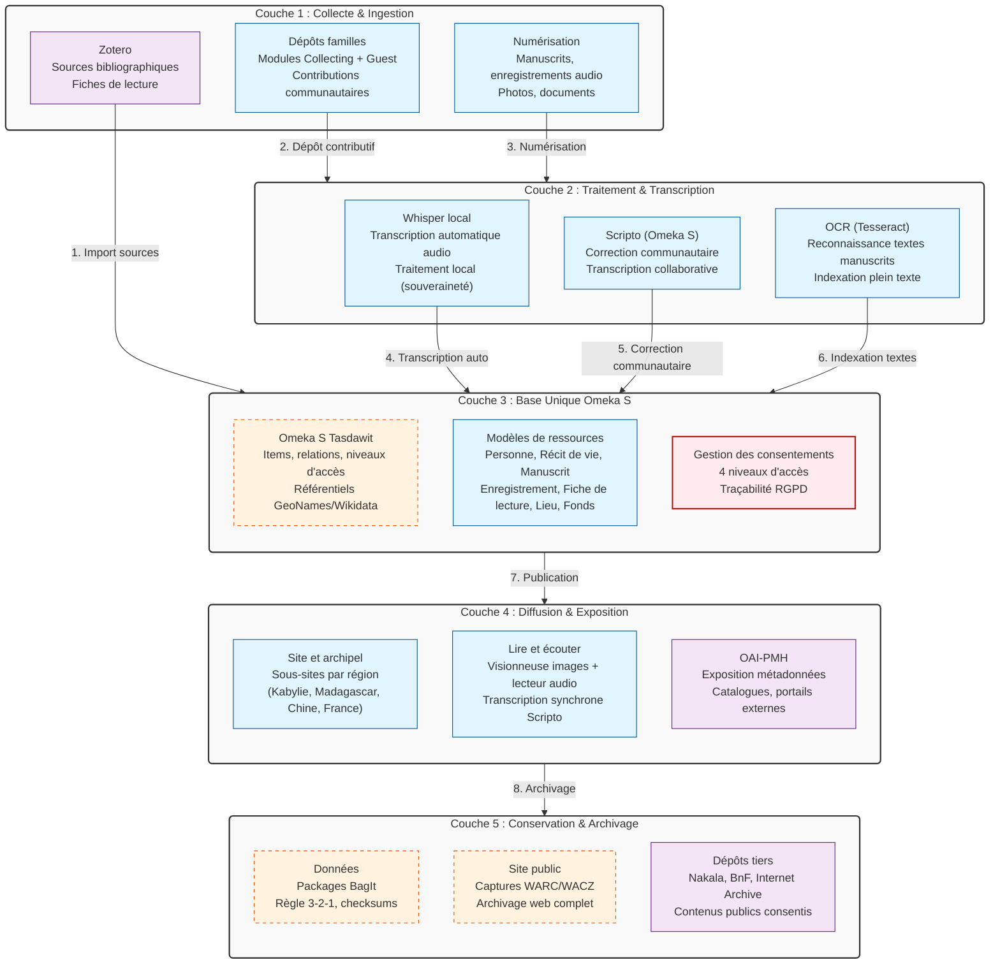

# Fiche Définition : Architecture Plateforme Patrimoniale Tasdawit

## 1. Définition courte (Opérationnelle)

Tasdawit est une **plateforme patrimoniale unifiée** basée sur Omeka S, dédiée à la collecte, la transcription collaborative et la diffusion de récits de vie, mémoires familiales et documents patrimoniaux (manuscrits, audio). L'architecture repose sur une **base unique Omeka S** alimentée par trois flux d'entrée (Zotero pour les sources, dépôts familles via Collecting/Guest, numérisation), et diffusée via des sous-sites thématiques par région (Kabylie, Madagascar, Chine, France) avec lecture synchrone audio/transcription.

> **Synthèse** : Une architecture en cinq couches (collecte → traitement → base unique → diffusion → conservation) qui place la communauté au cœur de la transcription (Scripto) et préserve les consentements à chaque niveau d'accès.

---

## 2. Définition longue (Contextuelle et Méthodologique)

Tasdawit prolonge le laboratoire du même nom en industrialisant une chaîne de traitement patrimoniale complète, de la collecte familiale à la conservation à long terme, en passant par la transcription communautaire.

### Fonctionnement architectural
Le système est structuré en **cinq couches horizontales** :
1. **Collecte** : Trois canaux d'entrée (Zotero pour les sources bibliographiques, dépôts familles via modules Collecting/Guest, numérisation de manuscrits/audio)
2. **Traitement** : Transcription automatique locale (Whisper), correction communautaire (Scripto), OCR des manuscrits
3. **Base unique** : Omeka S centralise tous les items, relations, niveaux d'accès et référentiels
4. **Diffusion** : Site Tasdawit avec sous-sites par région, visionneuse d'images, lecteur audio synchrone avec transcription, exposition OAI-PMH
5. **Conservation** : Packages BagIt (3-2-1), captures WARC/WACZ du site public, dépôts tiers (Nakala, BnF, IA) pour les contenus publics consentis

### Enjeux d'accessibilité (RGAA / WCAG)
La lecture synchrone (audio + transcription) est un atout majeur pour l'accessibilité. La visionneuse d'images et le lecteur audio doivent être navigables au clavier et compatibles avec les lecteurs d'écran. Les transcriptions Scripto doivent être structurées sémantiquement.

### Enjeux d'Architecture de l'Information et Interopérabilité
Omeka S sert de hub central avec alignement sur des référentiels externes (GeoNames pour les lieux, Wikidata pour les personnes connues). L'exposition OAI-PMH permet l'indexation par des catalogues et portails patrimoniaux externes. Les modèles de ressources (Personne, Récit de vie, Manuscrit, Enregistrement, Fiche de lecture, Lieu, Fonds) sont standardisés et réutilisables.

### Souveraineté, Éthique et Consentement
Les données sont sensibles (récits de vie, mémoires familiales). Quatre niveaux d'accès sont gérés dans Omeka S (public, privé, consenti, restreint) avec traçabilité des consentements. L'hébergement doit être en France/Europe, idéalement certifié HDS. La conservation suit la règle 3-2-1 via BagIt.

---

## 3. Architecture Technique et Stack

---

## 4. Flux d'exécution typique

**Étape 1 — Collecte** : Une famille dépose un enregistrement audio de récit de vie et des photos de manuscrits via le module Collecting (avec consentement signé).

**Étape 2 — Transcription automatique** : Whisper (local, souverain) transcrit l'audio en texte brut. Le module OCR extrait le texte des manuscrits numérisés.

**Étape 3 — Correction communautaire** : La transcription est publiée dans Scripto. Les membres de la communauté (famille, chercheurs) corrigent et enrichissent le texte collaborativement.

**Étape 4 — Structuration Omeka S** : L'administrateur crée un Item "Récit de vie" lié à une Personne (alignée sur Wikidata), un Lieu (aligné sur GeoNames), et un Fonds. Les niveaux d'accès sont définis (ex: audio privé, transcription publique après consentement).

**Étape 5 — Diffusion synchrone** : Sur le sous-site "Kabylie", l'utilisateur accède à la page du récit. Il peut écouter l'audio tout en suivant la transcription synchronisée, et visualiser les manuscrits dans la visionneuse d'images.

**Étape 6 — Conservation** : Les données sont packagées en BagIt (avec checksums), le site public est capturé en WARC/WACZ, et les contenus publics consentis sont déposés dans Nakala ou Internet Archive pour pérennisation.

---

## 5. Points de Vigilance Méthodologiques

### 1. Consentement et Niveaux d'accès (RGPD)
- Implémenter **quatre niveaux d'accès** dans Omeka S : public (tout le monde), privé (administrateurs uniquement), consenti (accès sur autorisation explicite), restreint (famille/communauté spécifique).
- Tracer systématiquement le consentement (qui, quand, pour quoi) dans les métadonnées de l'item.
- Permettre le retrait du consentement à tout moment (droit à l'oubli RGPD).

### 2. Transcription collaborative et Qualité
- Scripto permet la correction communautaire, mais nécessite une **modération a priori** pour valider les contributions.
- Whisper (transcription auto) doit être utilisé en local (souveraineté) et non via API cloud pour protéger les données sensibles.
- Prévoir un système de validation à deux yeux (contributeur + validateur) pour les transcriptions critiques.

### 3. Accessibilité et Lecture synchrone
- La synchronisation audio/transcription doit être précise (time-coding) pour permettre la navigation dans le texte.
- La visionneuse d'images (IIIF si possible) doit être accessible au clavier et aux lecteurs d'écran.
- Les transcriptions doivent être structurées en HTML sémantique (paragraphes, titres) et non en texte brut.

### 4. Alignement sémantique et Interopérabilité
- Aligner systématiquement les **Personnes** connues sur Wikidata (via le module Value Suggest) et les **Lieux** sur GeoNames.
- Exposer les métadonnées via OAI-PMH pour l'indexation par des portails patrimoniaux (Europeana, Gallica, etc.).
- Utiliser des vocabulaires contrôlés (Dublin Core, MODS) pour garantir l'interopérabilité à long terme.

### 5. Conservation et Pérennisation
- Appliquer la règle **3-2-1** (3 copies, 2 supports différents, 1 copie hors site) via BagIt.
- Capturer régulièrement le site public en WARC/WACZ pour préserver l'expérience de consultation.
- Déposer les contenus publics consentis dans des dépôts tiers de confiance (Nakala pour les SHS, BnF via dépôt légal, Internet Archive pour la résilience).

### 6. Performance et Scalabilité
- Omeka S peut gérer plusieurs sites (Tasdawit + Madacity) sur une même installation, mais pour Tasdawit seul, une installation dédiée simplifie la gestion des consentements et des droits.
- Prévoir un serveur avec suffisamment de RAM pour Whisper (transcription auto) et ImageMagick (génération de vignettes).
- Mettre en place un CDN (Cloudflare) pour la diffusion des médias lourds (audio, images HD).

---

## 6. Recommandations de Démarrage

### Pour un MVP (Lancement initial)
- **Infrastructure** : Mutualisé de qualité ou petit VPS en France (OVHcloud, Scaleway), Apache + PHP 8.2/8.3 + MariaDB.
- **Omeka S** : Installation dédiée avec modules de base + Collecting, Guest, Scripto, Value Suggest, Mapping, CSV Import, Advanced Search.
- **Traitement** : Whisper installé en local (modèle small ou medium), Tesseract pour l'OCR.
- **Contenu** : Commencer avec 2-3 sous-sites pilotes (ex: Kabylie + Madagascar) et 10-15 récits de vie complets pour tester la chaîne.

### Pour une mise en production évolutive (V2/V3)
- **IIIF** : Ajouter le module IIIF Server dans Omeka S pour la manipulation avancée d'images (zoom profond, annotations).
- **Automatisation** : Scripts bash pour l'import batch depuis Zotero, la génération de packages BagIt automatisée, et les dépôts vers Nakala via API.
- **Multilingue** : Support arabe/français/anglais pour les métadonnées et les transcriptions (Omeka S gère nativement le multilingue).
- **Recherche avancée** : Intégration Elasticsearch pour la recherche plein texte dans les transcriptions et les OCR.

---

## 7. Questions ouvertes à valider

- [ ] **Hébergement** : Mutualisé ou VPS ? Besoin HDS (données de santé si récits médicaux) ou simple RGPD ?
- [ ] **Modération** : Qui valide les transcriptions Scripto ? Système à deux niveaux (contributeur/validateur) ou validation a posteriori ?
- [ ] **Consentements** : Formulaire papier ou numérique ? Stockage des consentements signés dans Omeka S (module Guest) ou système externe ?
- [ ] **Sous-sites** : Liste définitive des régions de l'archipel (Kabylie, Madagascar, Chine, France, autres ?)
- [ ] **Dépôts tiers** : Priorité à Nakala (Huma-Num), BnF (dépôt légal numérique), ou Internet Archive ?

---

> *Note : Cette fiche est conçue pour être un artefact d'architecture de l'information vivant. Elle formalise la chaîne patrimoniale complète de Tasdawit, de la collecte familiale à la conservation à long terme, en passant par la transcription communautaire et la diffusion respectueuse des consentements.*