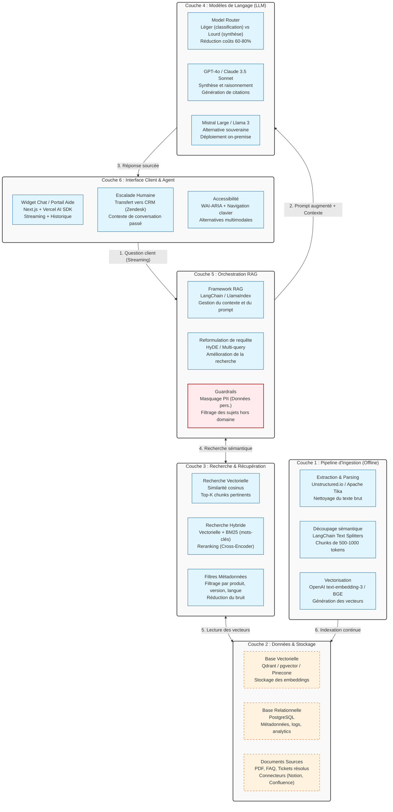

# Fiche Définition : Architecture RAG pour Service Client

## 1. Définition courte (Opérationnelle)

Le **RAG (Retrieval-Augmented Generation)** pour service client désigne un mode d'interaction où un assistant virtuel (chatbot ou agent) s'appuie sur une base de connaissances interne et actualisée (FAQ, documentation technique, CRM) pour générer des réponses précises, contextuelles et sourcées. Contrairement à un LLM standard qui répond uniquement avec ses connaissances d'entraînement (risquant les hallucinations), le RAG "augmente" le modèle en lui fournissant les faits exacts de l'entreprise avant qu'il ne rédige la réponse.

> **Synthèse** : Le RAG ancre l'IA dans la réalité métier de l'entreprise, transformant un générateur de texte généraliste en un expert fiable, traçable et maîtrisé.

---

## 2. Définition longue (Contextuelle et Méthodologique)

Cette approche est devenue le standard pour moderniser les centres de contact (Tier 1) et les centres d'aide en ligne, car elle réduit drastiquement la charge des agents humains tout en améliorant la satisfaction client.

### Fonctionnement architectural
Le système repose sur deux pipelines distincts :
1. **Pipeline d'Ingestion (Offline)** : Les documents bruts (PDF, pages web, tickets résolus) sont nettoyés, découpés en chunks sémantiques, puis vectorisés (embeddings) pour être stockés dans une base vectorielle.
2. **Pipeline de Requête (Online)** : Lorsqu'un client pose une question, le système recherche les chunks les plus pertinents (recherche sémantique), les injecte dans le prompt du LLM, et génère une réponse synthétique en citant ses sources.

### Enjeux d'accessibilité (RGAA / WCAG)
L'interface de chat doit être 100 % navigable au clavier et compatible avec les lecteurs d'écran (NVDA, VoiceOver). Les réponses générées doivent être structurées sémantiquement (listes, titres, liens vers la documentation source). Un fallback humain (escalade vers un agent) doit être accessible en un clic à tout moment.

### Enjeux d'Architecture de l'Information et SEO
Le RAG internalise la recherche. Pour le SEO, le centre d'aide public (FAQ) doit rester en HTML sémantique classique (SSR/SSG) pour être indexé par Google. Le RAG agit comme une couche de recherche conversationnelle en surcouche, sans cannibaliser l'indexation du site public.

### IA Responsable et Éthique
La protection des données personnelles (PII) est critique : les requêtes clients ne doivent pas être envoyées brutes aux LLM publics sans masquage préalable. Le système doit être transparent (indiquer qu'il s'agit d'une IA) et fournir des liens vers les sources officielles pour permettre à l'utilisateur de vérifier l'information.

---

## 3. Architecture Technique et Stack

---

## 4. Flux d'exécution typique

**Étape 1 — Ingestion (Offline)** : Un nouveau guide technique PDF est ajouté. Le pipeline d'ingestion le parse, le découpe en 45 chunks sémantiques, les vectorise via un modèle d'embedding, et les stocke dans Qdrant avec des métadonnées (produit: "Routeur X", version: "2.0").

**Étape 2 — Requête Client** : Un utilisateur demande : "Comment réinitialiser mon routeur X quand le voyant rouge clignote ?" via le widget chat.

**Étape 3 — Orchestration & Sécurité** : Le système masque les éventuelles données personnelles (PII) dans la requête, puis reformule la question pour optimiser la recherche (ex: "Procédure réinitialisation Routeur X voyant rouge").

**Étape 4 — Récupération (Retrieval)** : La recherche hybride (vectorielle + mots-clés) interroge la base vectorielle, filtre sur la métadonnée "Routeur X", et récupère les 3 chunks les plus pertinents (score > 0.85).

**Étape 5 — Génération** : Le LLM (ex: Mistral Large) reçoit le prompt système, les 3 chunks de contexte, et la question. Il rédige une réponse claire, étape par étape, en ajoutant des liens vers les pages sources.

**Étape 6 — Affichage et Fallback** : La réponse s'affiche en streaming. Si le score de confiance est bas ou si l'utilisateur répond "Je ne comprends pas / Je veux un humain", le système transfère la conversation vers un agent Zendesk avec l'historique complet.

---

## 5. Points de Vigilance Méthodologiques

### 1. Sécurité et Protection des Données (PII)
- Ne jamais envoyer de données personnelles (noms, emails, numéros de commande) brutes aux LLM publics. Utiliser des bibliothèques de masquage (ex: Microsoft Presidio) avant l'appel API.
- Isoler les données clients dans des namespaces ou collections séparés dans la base vectorielle (multi-tenancy).

### 2. Lutte contre les Hallucinations et Guardrails
- Implémenter une vérification de fidélité (Faithfulness check) : le LLM doit citer ses sources. Si la réponse ne s'appuie pas sur les chunks récupérés, elle doit être bloquée.
- Définir un prompt système strict : "Si la réponse n'est pas dans le contexte fourni, réponds 'Je n'ai pas cette information' et propose un transfert humain."

### 3. Qualité de la Recherche (RAG Evaluation)
- La qualité du RAG dépend à 80 % de la qualité de l'ingestion (chunking) et de la récupération (retrieval). Tester différentes tailles de chunks et stratégies de découpage.
- Utiliser des frameworks d'évaluation (RAGAS, DeepEval) pour mesurer la "Context Recall" et la "Answer Faithfulness" sur un jeu de données de test (Golden Dataset).

### 4. Accessibilité non négociable
- Le widget de chat doit respecter les contrastes, être navigable au clavier, et annoncer les nouvelles réponses via `aria-live="polite"`.
- Les réponses générées doivent utiliser du HTML sémantique (listes `<ul>`, liens `<a>` avec `title`) et non du texte brut.

### 5. Latence et Coûts
- La recherche vectorielle et le Reranking ajoutent de la latence. Utiliser des modèles d'embedding légers et locaux (ex: BGE-small) pour la vitesse.
- Mettre en cache les réponses pour les questions fréquentes (FAQ cache) afin de réduire les appels LLM coûteux.

### 6. Transparence et Confiance Utilisateur
- Indiquer clairement à l'utilisateur qu'il interagit avec une IA ("Assistant virtuel").
- Afficher systématiquement les liens vers les documents sources officiels ("Voir le guide complet") pour permettre la vérification et renforcer la confiance.

---

## 6. Recommandations de Démarrage

### Pour un MVP (Minimum Viable Product)
- **Ingestion** : Script Python simple avec LangChain Text Splitters et OpenAI Embeddings.
- **Stockage** : PostgreSQL + pgvector (tout-en-un, simple à héberger).
- **Orchestration** : LlamaIndex (plus simple que LangChain pour un RAG basique).
- **LLM** : Mistral Large ou Claude 3.5 Sonnet (excellent rapport qualité/prix pour la synthèse).
- **Interface** : Widget chat basique avec Vercel AI SDK.

### Pour une mise en production (Échelle Enterprise)
- **Recherche** : Passer à une recherche hybride (Vectorielle + BM25) avec un modèle de Reranking (Cross-Encoder) pour une précision maximale.
- **Sécurité** : Intégrer Microsoft Presidio pour le masquage PII en temps réel.
- **Évaluation** : Mettre en place une pipeline CI/CD avec RAGAS pour évaluer la qualité à chaque mise à jour de la base de connaissances.
- **Souveraineté** : Déployer les modèles d'embedding et le LLM en local (Ollama / vLLM) ou sur des infrastructures souveraines (Scaleway, Mistral API) si les données sont sensibles.
- **Expérience Agent** : Intégrer un module de "Copilote Agent" qui suggère des réponses aux agents humains en temps réel, avec validation manuelle avant envoi.

---

> *Note : Cette fiche est conçue pour être un artefact d'architecture de l'information vivant. Elle est versionnable, modifiable et sert de référence pour l'alignement entre les équipes techniques, les responsables de centre de contact et les décideurs.*