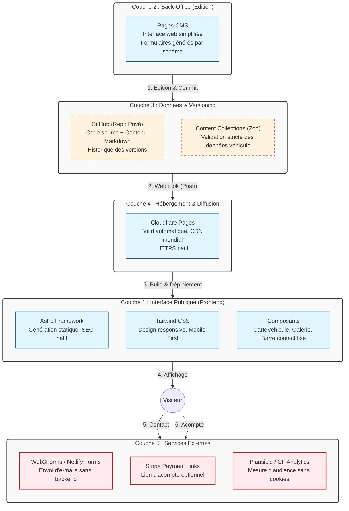

# Fiche Définition : Architecture Site Vitrine & Catalogue Auto (Headless)

## 1. Définition courte (Opérationnelle)

Ce projet consiste à remplacer un site vieillissant (type Jimdo/Wix) par un **site statique ultra-performant** (Astro) couplé à un **back-office simplifié** (Pages CMS). Il permet à un professionnel de l'automobile d'occasion de gérer son catalogue (ajout, modification, statut "vendu") de manière autonome, sans compétence technique. L'objectif n'est pas la vente en ligne, mais la **génération de leads qualifiés** (appels téléphoniques, messages WhatsApp pré-remplis) et le renforcement du référencement local.

> **Synthèse** : Une architecture "Zero-Maintenance" qui allie la simplicité d'édition d'un CMS grand public à la performance, la sécurité et le coût quasi nul d'un site statique hébergé sur CDN.

---

## 2. Définition longue (Contextuelle et Méthodologique)

Cette approche répond aux limites des constructeurs de sites classiques (abonnements mensuels, risques de sécurité WordPress, catalogues véhicules rigides) en proposant une stack moderne mais accessible au non-développeur.

### Fonctionnement architectural
Le système repose sur un flux **Git-based** : le client édite le contenu via une interface web (Pages CMS). Chaque modification génère automatiquement un *commit* dans un dépôt GitHub privé. Ce commit déclenche un *webhook* vers l'hébergeur (Cloudflare Pages), qui reconstruit le site statique en 1 à 2 minutes et le diffuse via un CDN mondial. Aucune base de données dynamique n'est interrogée lors de la visite.

### Enjeux d'accessibilité (RGAA / WCAG)
L'expérience est conçue "Mobile First". Une barre de contact fixe en bas d'écran (Appeler / WhatsApp) doit être accessible sans masquer le contenu, navigable au clavier, et les images de véhicules doivent toutes disposer d'attributs `alt` descriptifs (gérés nativement via le formulaire du CMS).

### Enjeux d'Architecture de l'Information et SEO
Le levier principal est le SEO local. Le site doit consolider l'identité numérique (nom unique partout) et enrichir la fiche Google Business Profile. Chaque fiche véhicule intègre des données structurées (`schema.org/Vehicle` et `Offer`) pour apparaître dans les résultats enrichis. Le sitemap est généré automatiquement à chaque build.

### Conformité, Légal et Éthique
L'architecture privilégie la "Privacy by Design" : utilisation d'outils d'audience sans cookies (Plausible ou Cloudflare Analytics) pour éviter les bandeaux de consentement intrusifs. Les mentions légales, la gestion de la TVA (marge ou normale) et l'absence de mention "crédit" (si non inscrit ORIAS) sont intégrées structurellement.

---

## 3. Architecture Technique et Stack

---

## 4. Flux d'exécution typique

**Étape 1 — Édition (Client)** : Le professionnel se connecte à Pages CMS, remplit le formulaire "Nouveau véhicule" (Réf: MK-024, Renault Trafic, 8900€, 15 photos), et clique sur "Publier".

**Étape 2 — Versioning** : Pages CMS crée un commit dans le dépôt GitHub privé, ajoutant un fichier `src/content/vehicules/mk-024.md` et poussant les images.

**Étape 3 — Déploiement** : GitHub déclenche un webhook vers Cloudflare Pages. Astro lit le nouveau fichier Markdown, valide le schéma Zod, génère la page HTML statique `/vehicules/mk-024` et optimise les images en WebP. Le site est en ligne en ~90 secondes.

**Étape 4 — Conversion (Visiteur)** : Un utilisateur trouve le véhicule via Google. Sur mobile, il clique sur le bouton fixe "WhatsApp".

**Étape 5 — Contact qualifié** : L'application WhatsApp s'ouvre avec un message pré-rempli : *"Bonjour, je suis intéressé par le Renault Trafic L1H1 (Réf: MK-024) à 8900€. Est-il disponible ?"*

**Étape 6 — Vente et Clôture** : La vente est conclue au garage. Le professionnel retourne dans Pages CMS, passe le statut du véhicule à "Vendu". Le site affiche un bandeau "Vendu" pendant 14 jours (pour le SEO et la transparence), puis le véhicule est archivé.

---

## 5. Points de Vigilance Méthodologiques

### 1. Cohérence des données et SEO Local
- **Nom unique** : Le nom commercial doit être strictement identique sur le site, la fiche Google Business Profile, Facebook et les annonces.
- **Schema.org** : Implémenter rigoureusement les balises `AutoDealer` (page d'accueil) et `Vehicle` + `Offer` (fiches produits) pour maximiser la visibilité locale.

### 2. Conformité légale et commerciale
- **Mentions légales** : Doivent inclure le SIREN de la société, le siège social et les coordonnées du directeur de publication.
- **Régime TVA** : Préciser clairement si le prix est HT, TTC, ou "TVA non applicable, art. 293 B du CGI" (régime de la marge).
- **Règles ORIAS** : Ne jamais afficher de mention "possibilité de financement/crédit" si le client n'est pas immatriculé à l'ORIAS.

### 3. Gestion du cycle de vie des véhicules
- Un véhicule "Vendu" ne doit pas disparaître brutalement (mauvais pour l'UX et le SEO). Il doit rester visible 14 jours avec un statut clair, puis être déplacé dans un dossier `/archive` ou supprimé du front.
- Le tri par défaut de la liste doit toujours être "Date d'ajout décroissante".

### 4. Accessibilité et Mobile First
- La barre de contact fixe en bas d'écran sur mobile ne doit pas masquer le contenu (utiliser `padding-bottom` sur le conteneur principal).
- Les liens `tel:` et `mailto:` doivent être testés sur de vrais appareils iOS et Android.

### 5. Sécurité et Maintenance
- Le dépôt GitHub doit être **privé**. L'accès au CMS se fait par invitation e-mail (sans nécessiter de compte GitHub pour le client).
- Le freelance n'a aucune maintenance de sécurité (pas de plugins à mettre à jour), mais doit fournir une **fiche mémo PDF** simple pour l'utilisation du CMS.

### 6. Suivi de la performance (Analytics)
- Configurer des "Événements personnalisés" dans l'outil d'audience pour tracker spécifiquement les clics sur "Appeler", "WhatsApp" et l'envoi du formulaire, afin de calculer le ROI du site pour le client.

---

## 6. Gestion du Nom de Domaine (NDD) & E-mails

Pour un site vitrine professionnel, le nom de domaine est l'actif numérique le plus critique. Sa gestion doit être sécurisée, souveraine et peu coûteuse.

### Choix du Registrar
Évite les registrars internationaux opaques. Deux options recommandées :
- **Cloudflare Registrar** (Recommandé) : Prix coûtant (sans marge), protection WHOIS gratuite incluse, intégration native avec Cloudflare Pages. (~9 à 12 € / an).
- **OVHcloud** : Acteur français, souveraineté des données, interface familière. (~10 à 15 € / an).

### Configuration DNS pour Cloudflare Pages
Deux enregistrements suffisent (souvent automatisés si le domaine est chez Cloudflare) :
- `CNAME` `www` → `<nom-du-projet>.pages.dev`
- `CNAME` `@` (ou vide) → `<nom-du-projet>.pages.dev` (Cloudflare aplatit ce CNAME en enregistrement A).
*Le certificat SSL (HTTPS) est géré nativement et gratuitement par Cloudflare.*

### Le piège des e-mails professionnels
Héberger une boîte mail complète (Google Workspace, Microsoft 365) coûte 6 à 12 € **par mois**, ce qui brise l'objectif de "coût de fonctionnement proche de zéro".
- **Solution A (Gratuite)** : Utiliser **Cloudflare Email Routing**. Les e-mails envoyés à `contact@mon-domaine.fr` sont redirigés vers la boîte Gmail/Orange personnelle du client. (Limite : difficile de *répondre* avec l'adresse pro).
- **Solution B (Low-cost)** : Proposer une boîte mail dédiée à ~3 € / mois (ex: OVH Pro Email ou Zoho Mail) si le client souhaite émettre des e-mails avec son nom de domaine.

### SEO & Migration
Si le client possède déjà un ancien site, configurer une **redirection 301** dans Cloudflare (Règles > Redirect Rules) de l'ancienne URL racine vers la nouvelle pour préserver le "jus SEO". Mettre à jour l'URL immédiatement dans la fiche Google Business Profile.

---

## 7. Recommandations de Démarrage

### Pour un MVP (Lancement en 3 jours)
- **Stack** : Astro + Tailwind CSS + Content Collections (Zod).
- **CMS** : Pages CMS configuré avec le schéma véhicule de base.
- **Hébergement** : Cloudflare Pages (gratuit et rapide).
- **Contenu** : Intégrer 5 véhicules de test pour valider le flux d'édition et l'affichage.
- **Contact** : Web3Forms pour la réception des e-mails (simple, gratuit, pas de backend).

### Pour une mise en production (Optimisation & Confiance)
- **SEO Avancé** : Génération automatique du `sitemap.xml` et du `robots.txt` via `@astrojs/sitemap`.
- **Images** : Utilisation stricte du composant `<Image />` d'Astro pour garantir le format WebP/AVIF et éviter le layout shift.
- **Acompte** : Intégration de liens de paiement Stripe (Payment Links) pour les véhicules haut de gamme, avec des CGV claires sur la page de mention légale.
- **Migration** : Mettre en place une redirection 301 depuis l'ancien site vers la nouvelle page d'accueil.

---

## 8. Questions ouvertes à valider avec le client

- [ ] **Nom commercial** : Validation définitive du nom pour l'uniformiser partout (ex: "MK Autos Lyon Sud").
- [ ] **Services** : Liste exacte des prestations à afficher (VASP, reprise, aménagement spécifique ?).
- [ ] **Processus Acompte** : Souhaitent-ils activer les liens de paiement Stripe ? Si oui, quel montant (ex: 300 € ou 500 €) ?
- [ ] **E-mail** : La redirection gratuite (Cloudflare Routing) suffit-elle, ou faut-il une boîte mail pro dédiée (~3€/mois) ?
- [ ] **Opérationnel** : Qui, concrètement, prend les photos et saisit les véhicules au quotidien ? (Détermine le niveau de simplicité requis pour le CMS).

---

> *Note : Cette fiche est conçue pour être un artefact d'architecture de l'information vivant. Elle sert de cahier des charges technique, de référence pour le développement et de support de formation pour le client final.*