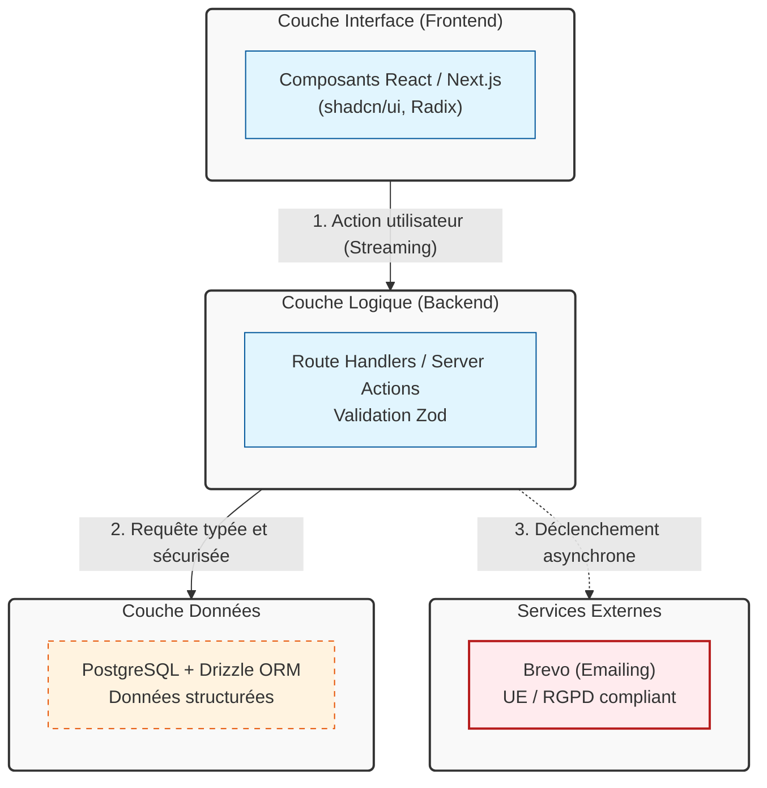

# 📐 Guide de rédaction de diagrammes Mermaid

Ce document établit les bonnes pratiques pour créer des diagrammes d'architecture clairs, maintenables et accessibles dans ce dépôt, en utilisant la syntaxe Mermaid.js.

## 🎯 Principes fondamentaux

1. **Sobriété** : Un diagramme doit transmettre une idée en moins de 10 secondes. Limitez-vous à 15-20 nœuds maximum par schéma.
2. **Sémantique** : Les identifiants des nœuds doivent être explicites et en anglais technique ou français clair (ex: `db_users` ou `BaseDonnees` plutôt que `A` ou `Node1`).
3. **Cohérence** : Utilisez les mêmes couleurs et formes pour les mêmes types de composants (ex: toutes les bases de données en orange, tous les services externes en rouge).
4. **Accessibilité** : Un diagramme Mermaid n'est pas nativement lu par les lecteurs d'écran. Il **doit** toujours être accompagné d'une description textuelle ou d'un tableau récapitulatif juste en dessous du bloc de code.

---

## 🛠️ Bonnes pratiques de syntaxe

### 1. Utilisez des `classDef` pour le style
Évitez le style en ligne (`style A fill:#f9f`) qui alourdit le code et le rend illisible. Définissez des classes réutilisables en haut du diagramme.

```mermaid
%% Définition des styles (à placer en haut du bloc)
classDef layer fill:#f9f9f9,stroke:#333,stroke-width:2px,rx:5,ry:5
classDef component fill:#e1f5fe,stroke:#01579b,stroke-width:1px
classDef data fill:#fff3e0,stroke:#e65100,stroke-width:1px,stroke-dasharray: 5 5
classDef external fill:#ffebee,stroke:#b71c1c,stroke-width:2px
```

### 2. Structurez avec des `subgraph`
Regroupez les éléments par couche logique, par domaine fonctionnel ou par responsabilité pour faciliter la lecture hiérarchique.

```mermaid
subgraph FRONTEND ["Couche Frontend (Client)"]
    direction TB
    UI["Interface Utilisateur (React/Next.js)"]:::component
end
```

### 3. Nommez les flèches (relations)
Les relations doivent expliquer le *pourquoi* ou le *comment* du flux, pas seulement le sens de la connexion.

```mermaid
UI -->|"1. Requête HTTP (JSON)"| API
API -->|"2. Lecture/Écriture typée"| DB
```

### 4. Forcez l'orientation
Utilisez `flowchart TD` (Top-Down) pour les architectures en couches, ou `flowchart LR` (Left-Right) pour les flux chronologiques ou les parcours utilisateur.

---

## 🚫 Pièges à éviter

- **Les diagrammes "Spaghetti"** : Trop de croisements de flèches. Si le diagramme devient illisible, scindez-le en deux vues (ex: une vue macro "Couches" et une vue micro "Flux de données").
- **Le jargon non défini** : Si vous utilisez un acronyme (ex: RAG, HITL, SSR), assurez-vous qu'il est défini dans la fiche ou dans le glossaire du dépôt.
- **L'oubli du fallback textuel** : Ne jamais laisser un bloc ````mermaid` sans paragraphe explicatif juste en dessous pour les utilisateurs de technologies d'assistance.

---

## 📋 Template de base à copier-coller

Voici un squelette robuste et standardisé pour vos futures fiches d'architecture dans ce dépôt :

````markdown


> **Description du diagramme** : Ce schéma illustre le flux unidirectionnel des données. L'interface (UI) déclenche une action, la couche API la valide et la transforme, puis la couche Données la persiste. Les services externes sont sollicités de manière asynchrone. Les styles distincts permettent d'identifier rapidement la nature et la criticité de chaque composant.